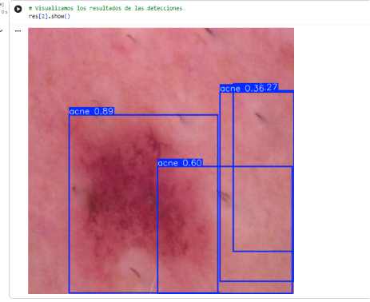
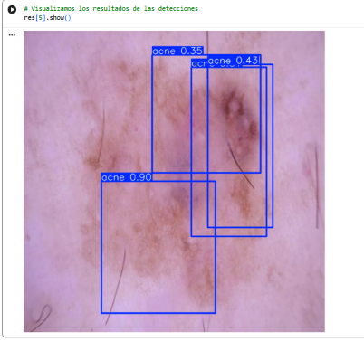
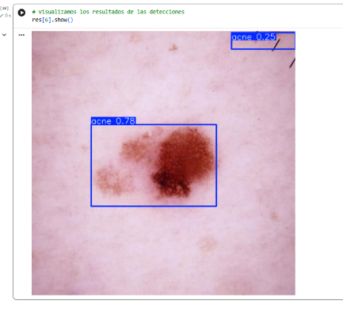
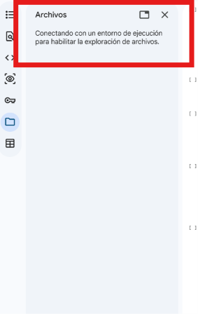
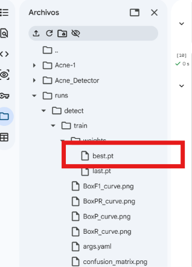
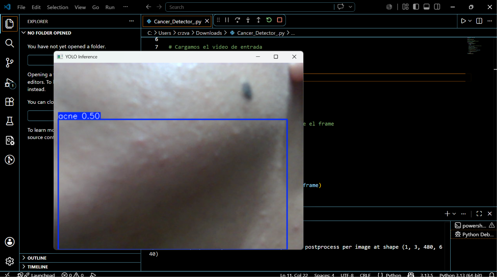

# Acne_Detector

## ¿Qué es el acné?
El acné es una condición visible en la piel que puede variar en cantidad, tamaño y distribución. En muchos casos, el seguimiento de la evolución del acné se realiza de forma visual, comparando fotografías tomadas en distintos momentos. Sin embargo, este proceso puede ser subjetivo, ya que depende de la observación manual de la persona que analiza las imágenes.

El problema que busca resolver este proyecto es apoyar el análisis visual de imágenes faciales mediante un modelo de visión artificial capaz de detectar zonas donde aparece acné. El sistema no reemplaza la valoración médica profesional, pero puede funcionar como una herramienta de apoyo para identificar regiones afectadas, generar evidencia visual y facilitar el seguimiento de cambios en la piel a lo largo del tiempo.

## Caso de Estudio

En una aplicación real, este modelo podría implementarse en una clínica dermatológica, consultorio médico, farmacia dermatológica o incluso en una aplicación móvil enfocada en el monitoreo de la piel. El usuario colocaría una zona específica de la piel frente a una cámara o cargaría una imagen desde el dispositivo, y el sistema procesaría esa imagen para detectar automáticamente zonas con posible presencia de acné.

El problema que busca resolver este proyecto es apoyar el seguimiento visual del acné, ya que normalmente este proceso se realiza comparando fotografías tomadas en diferentes momentos. Esta comparación puede ser subjetiva, porque depende de la observación manual de la persona que analiza la imagen. Con ayuda del modelo de visión artificial, se pueden detectar regiones afectadas y generar evidencia visual mediante bounding boxes, lo cual permite tener un registro más claro y ordenado.

Para implementar este sistema en la vida real, se podría utilizar una cámara web HD, una cámara de celular o una cámara digital para capturar imágenes de la piel. También sería recomendable contar con iluminación LED constante para evitar sombras y mejorar la calidad de la imagen. El procesamiento del modelo podría realizarse en una computadora, laptop, mini PC o dispositivo móvil con capacidad suficiente para ejecutar el modelo entrenado. Además, se necesitaría una pantalla o interfaz gráfica donde el usuario pueda observar la imagen original y el resultado con las detecciones.

El flujo de funcionamiento sería sencillo. Primero, el usuario coloca la zona de piel frente a la cámara o carga una imagen en el sistema. Después, el software recibe la imagen y la envía al modelo YOLO entrenado. El modelo analiza la imagen y localiza las regiones donde detecta posible presencia de acné. Posteriormente, el sistema dibuja los bounding boxes sobre las zonas detectadas y muestra el resultado en pantalla. Finalmente, la imagen procesada puede guardarse como evidencia para comparaciones futuras.

A diferencia de un sistema industrial donde la señal del modelo podría activar una máquina o un brazo robótico, en este caso la señal sería recibida por un sistema de análisis visual. El modelo generaría las coordenadas de las detecciones y el software las utilizaría para marcar las zonas afectadas en la imagen. Con esta información, el sistema podría mostrar las detecciones, guardar imágenes procesadas, contar la cantidad aproximada de zonas detectadas y generar un historial visual para apoyar el seguimiento del usuario o del especialista.

Este modelo no debe utilizarse como diagnóstico médico definitivo, ya que puede cometer errores si la imagen tiene mala iluminación, baja resolución, sombras, rostro parcialmente cubierto o condiciones visuales similares al acné. Su función principal sería servir como una herramienta de apoyo visual para detección, documentación y monitoreo de la evolución de la piel.

## Ejecución del código 

Para poder ejecutar el código es necesario tener una cuenta en google colab.

Los pasos a seguir son: 

1. Abrir el archivo del notebook: Acne_det_.ipynb
2. Abrirlo en Google Colab.

Recomendación: Activa la GPU para mejorar el rendimiento del entrenamiento y evitar retardos del CPU, debes de ir a Entorno de ejecución → Cambiar tipo de entorno de ejecución → GPU

3. Ejecutar todas las celdas del notebook: Entorno de ejecución → Ejecutar todo
4. Al ejecutar podras ver que se realiza lo siguiente: 
   - Instalación de librerías necesarias.
   - Descarga del dataset.
   - Preparación de los datos.
   - Entrenamiento del modelo YOLO.
   - Generación del modelo entrenado.
   - Pruebas de detección.
   - Visualización de resultados con bounding boxes.

Es importante que para ver distintos resultados se modifique el numero mostrado en la ultima linea la cual tiene por default el numero dos:

res[2].show()

## Resultados 

## Notas 

Los documentos utilizados son generados en el mismo código, por lo tanto no es necesario hacer descargas extenas, solo se debe de tener en cuenta que al perder la conexión estos archivos no apareceran. 

## EXTRA 

Se puede realizar un seguimieto en tiempo real. 

Se necesita Visual Studio Codde, es necesario utilizar python e instalar lo siguiente en la terminal: 

& "C:\Users\ruta_modificar" -m pip install ultralytics opencv-python

También es necesario descagar el documento best, somo el mostrado en la imagen:

El bloque de texto es el siguiente: 

from ultralytics import YOLO
import cv2

model = YOLO("best.pt")

#video_path = "./Inputs/people_walking.mp4"
cap = cv2.VideoCapture(0)

while cap.isOpened():
    # Leemos el frame del video
    ret, frame = cap.read()
    if not ret:
        break

    # Realizamos la inferencia de YOLO sobre el frame
    results = model(frame)

    # Extraemos los resultados
    annotated_frame = results[0].plot()
    #print(annotated_frame)

    # Visualizamos los resultados
    cv2.imshow("YOLO Inference", annotated_frame)

    # El ciclo se rompe al presionar "Esc"
    if cv2.waitKey(1) & 0xFF == 27:
        break

cap.release()
cv2.destroyAllWindows()

Como resultado podemos hacer análsis de la piel en vivo (hay que considerar que se necesita una mejor iluminación para mejores resultados).

## Integrantes 

VALERIA ITZEL CRUZ RIVERA 23310313

CYNTHIA JANETTE GARCIA AMEZCUA 23110191

## Fuentes 

OMES. (2025, 7 mayo). ¡Detecta lo que tú quieras! 🤖 Crea tu propio DETECTOR DE OBJETOS personalizado con YOLO [Vídeo]. YouTube. https://www.youtube.com/watch?v=jj1xmJYquXg 
